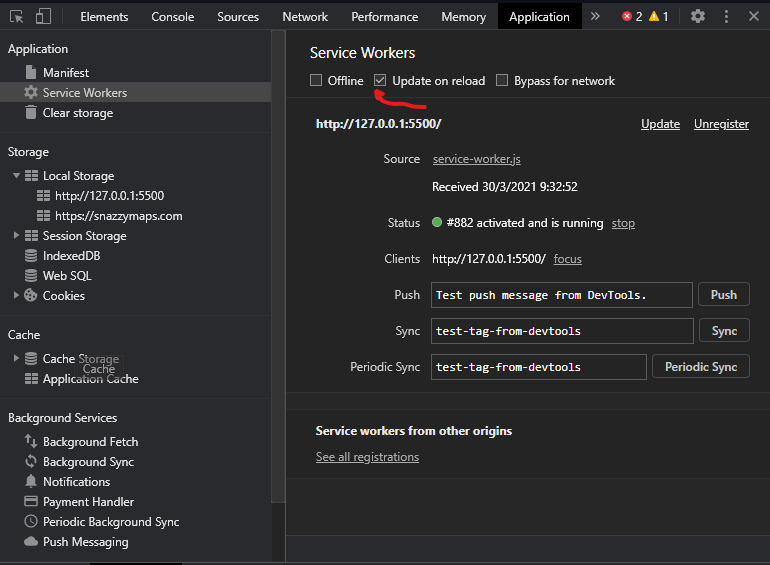

# Open Source UC Website

## Development

## Workflow
El workflow es PR a development -> Revisar preview en el comentario -> Asignar reviewers (gabo o yo, por el momento) -> Aprobación -> Merge a development

## Preview development branch:
https://staging.osuc.dev/

### Working with PWA support

if you're working with a browser that support PWA like chrome and a live server, must be activated the option update on reload in development tools.

